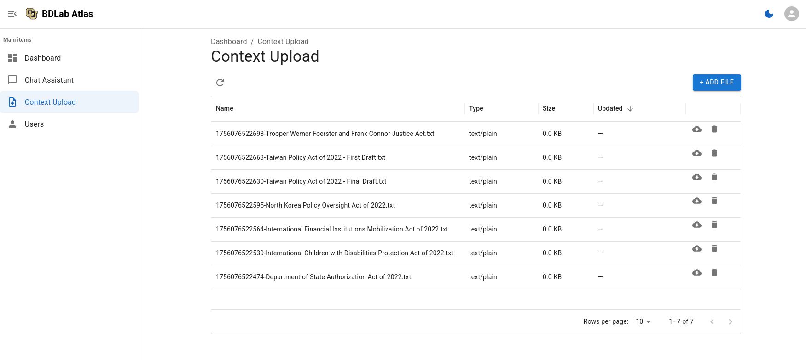
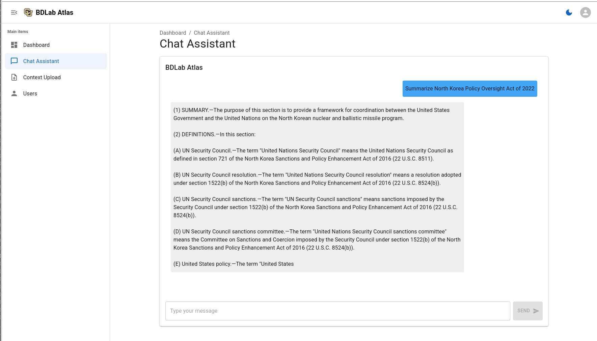

# BDLab Agent
A modular LLM/RAG demo platform using U.S. Senate Bills as real-world data for information retrieval, stylometric analysis, and document drafting research.

## Agent Demo

## Getting Started:
Clone the repo:

- `git clone git@github.com:UCD-BDLab/BDLab-Agent.git`

Create a virtual environment:

- `python -m venv .venv`

Activate the virtual environment:

- Unix: `source .venv/bin/activate`
- Windows: `source .venv/Scripts/activate`

Install dependencies:

- `pip install -r requirements.txt`
- Note: Install torch from [pytorch.org](https://pytorch.org/get-started/locally/) according to your system requirements.

Install Node dependencies:

- cd into `Lab-Agent`
- `npm install`

### Run Dev Environment:
After downloading the dataset and the models:

- Open two separate terminal windows
- terminal one: cd into `Lab-Agent` and run `npm run dev`
- terminal two: cd into `backend` and run `flask run`

## Dataset
This project uses the [Authorship Attribution on a U.S. Senate Bill](https://www.kaggle.com/datasets/markjma/authorship-attribution-on-a-us-senate-bill) dataset from Kaggle.

The dataset contains the full text of several U.S. Senate bills, split into separate files for each bill and draft version. It is designed for authorship attribution, stylometric analysis, and document drafting research, and is well-suited for information retrieval and RAG experiments.

**Files Included:**  

- Department of State Authorization Act of 2022.txt  
- International Children with Disabilities Protection Act.txt  
- International Financial Institutions Mobilization Act of 2022.txt  
- North Korea Policy Oversight Act of 2022.txt  
- Taiwan Policy Act of 2022 - Final Draft.txt  
- Taiwan Policy Act of 2022 - First Draft.txt  
- Trooper Werner Foerster and Frank Connor Justice Act.txt

Each `.txt` file contains the complete bill text, without separate metadata.

**License:**  

See the [Kaggle dataset page](https://www.kaggle.com/datasets/markjma/authorship-attribution-on-a-us-senate-bill) for license details. (As of writing, this dataset is released under a [CC0 1.0 Universal](https://creativecommons.org/publicdomain/zero/1.0/) license.)

## Embedding & LLM Models

The embedding and LLM models are downloaded from [Hugging Face](https://huggingface.co/).

**Note: Some models are gated.**

You may need to request access and be approved by the model authors before downloading and using these models.
If you have been granted access to a gated model, ensure you are logged in with your Hugging Face credentials (`huggingface-cli login`).

Visit the corresponding model page on Hugging Face and follow the instructions to get access.

### Embedding Models:

- **all‑MiniLM‑L6‑v2** (22 MB, 384‑D): fast and balanced.
- **all‑MPNet‑base‑v2** (around 420 MB, 768‑D): higher semantic accuracy but heavier compute.
- **multi‑qa‑MPNet‑base‑v2** (around 420 MB, 768‑D): tuned for question-answer retrieval.
- **paraphrase‑xlm‑r‑multi‑v1** (around 500 MB, 768‑D): multilingual retrieval, slowest of the set.

Currently testing **all‑MiniLM‑L6‑v2**.

### LLM Models:

- `gpt2-large` (774 Million parameters, causal): lightweight and fast. Good for testing working components.
- `tiiuae/falcon-7b` (7 Billion parameters, causal): efficient few‑shot generation.
- `meta-llama/Llama-2-7b-chat-hf` (7 Billion parameters, chat‑optimized): dialogue and instruction.
- `mistralai/Mistral-7B-v0.1` (7 Billion parameters, causal): versatile base model.
- `mistralai/Mistral-7B-Instruct-v0.2` (7 Billion parameters, instruct): enhanced instruction following.
- `meta-llama/Meta-Llama-3-8B-Instruct` (8 Billion parameters, instruct): balanced performance.
- `meta-llama/Meta-Llama-3-70B-Instruct` (70 Billion parameters, instruct): Instruction tuned, highest quality of the set. You need 24GB of GPU memory, but 48GB is recommended.

Currently testing: **meta-llama/Meta-Llama-3-8B-Instruct**.

## Architecture

- **Backend Configuration:** `DevelopmentConfig` vs. `ProductionConfig` chosen from environment variables.

- **Data Loading:** Performed in `app.py`. Reads all `.txt` files in `data/kaggle/us-senate-bill`, splits into paragraphs of 200 characters.
    - Will be moving this logic to an independent module outside `app.py`

- **Indexing:** Using `FAISS` from [Facebook Research]("https://github.com/facebookresearch/faiss")
    - A library for efficient similarity search and clustering of dense vectors
    - No actual database, runs on RAM.

- **Model Loading:** Currently performed manually and set to `gpt2-large`.
    - Will be adding drop down menu to allow users to select different models.

- **API:** `POST /api/qb` embeds the question, retrieves top-k passages, builds a prompt with file metadata, and returns a JSON answer.
    - Single API call that handles the chatbot.
    - Will be adding another API call to retrieve the information for the website `README.md`.

## System Specs

- OS: Ubuntu 24.04.2 LTS x86_64
- Host: Precision 3680
- Kernel: 6.11.0-29-generic
- Uptime: 3 days 17 h 51 m
- Packages: 2689 (deb), 13 (snap)
- Shell: bash 5.2.21
- Resolution: 2560×1440
- Window Manager: Xfwm4
- Theme: Yaru (GTK3)
- CPU: Intel Core i9‑14900K (32 threads) @ 5.7 GHz
- GPU‑0: NVIDIA Quadro RTX 4000
- GPU‑1: NVIDIA RTX 4000 Ada Generation
- RAM: 64 GB (10.7 GB used)

Note: Currently only utilizing GPU-0. Parallelization across both GPUs is planned.
